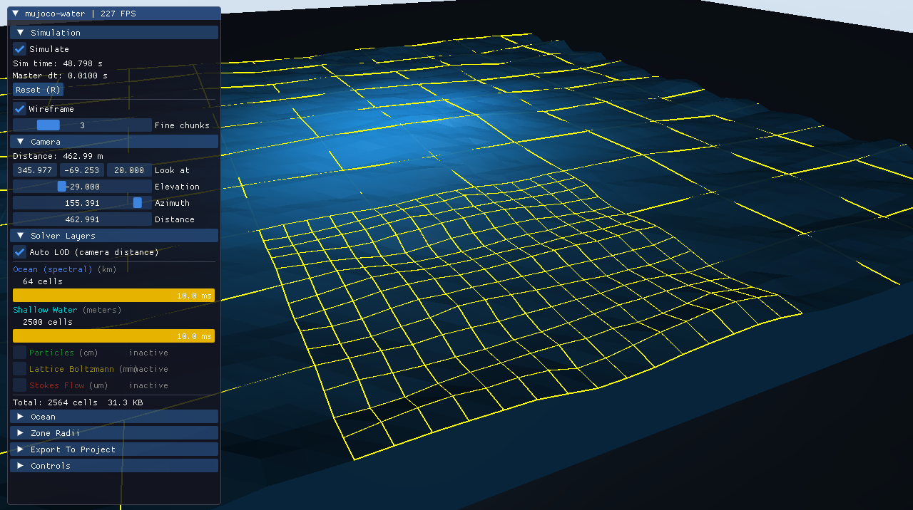

# mujoco-water

Header-only C++20 multiscale water simulation for [MuJoCo](https://mujoco.org/). Five concurrent LOD levels span roughly 10 orders of magnitude: spectral ocean (km) down to cellular-scale Stokes flow (um). The water surface renders as a single solid hfield volume. Forces apply via `data->xfrc_applied`; disable MuJoCo's built-in fluid model (`opt.density = 0; opt.viscosity = 0;`) to avoid double-counting.



MIT licensed.

---

## LOD Levels

| LOD | Method | Scale | Timestep | Physics |
|-----|--------|-------|----------|---------|
| 0 | Spectral Ocean | km, wavelength 1-300 m | master dt | Gerstner waves, Phillips/JONSWAP spectrum |
| 1 | Shallow Water (SWE) | pools to 1 km, dx 10 cm to 10 m | ~10 ms | HLL Riemann solver, MUSCL reconstruction, Manning friction |
| 2 | Smoothed Particle Hydrodynamics (SPH) | splashes, waves, ~cm | ~1 ms | WCSPH, Wendland C2 kernel, Tait EOS, XSPH, CSF surface tension |
| 3 | Lattice Boltzmann (LBM) | microfluidics, dx ~1 mm | ~0.01 ms | D3Q19 TRT collision, Guo forcing, bounce-back BCs |
| 4 | Stokes Flow | cellular/capillary, dx ~10 um | ~1 us | Creeping flow (Re << 1), concentration diffusion with source terms |

Ocean provides the far-field background. SWE covers the near field. SPH, LBM, and Stokes activate in progressively smaller focus zones and substep within their parent.

### Default zone radii (from focus point)

| LOD | Zone radius |
|-----|------------|
| 4 Stokes | 5 mm |
| 3 LBM | 5 cm |
| 2 SPH | 50 cm |
| 1 SWE | 50 m |
| 0 Ocean | beyond SWE |

---

## Architecture

The `Step()` pipeline runs the full hierarchy each frame:

```
Step(master_dt):
  1. UpdateLOD()                zone check; activate/deactivate solvers
  2. Ocean step                 advance spectral waves
     Ocean->SWE coupling        conservative boundary injection (tracked)
  3. Two-way body coupling      inject wave sources into SWE from body motion
  4. SWE step (MUSCL)           2nd-order TVD, HLL Riemann solver
  5. Absorbing sponge           damp edges (ocean relaxation or zero-momentum)
  6. Interface flux computation  HLL fluxes at SPH zone boundary
  7. SPH substeps               CFL-adaptive, N_sph per master step
     a. SWE->SPH ghost blend    boundary velocity nudging
     b. SPH flux tracking       detect particle boundary crossings
     c. SPH step                density, Tait pressure, forces, XSPH leapfrog
     d. LBM substeps            N_lbm per SPH step
        i.   SPH->LBM coupling  2nd-order lifting (feq + fneq from stress tensor)
        ii.  LBM step           TRT collision + Guo forcing + pull streaming
        iii. Stokes substeps    N_stokes per LBM step
             - LBM->Stokes      velocity/pressure boundary
             - Stokes step      diffuse, pressure project, concentration
        iv.  Stokes->LBM        non-equilibrium extrapolation
  8. Berger-Colella correction  reconcile SWE and SPH fluxes
  9. MuJoCo coupling            Morison forces (Re-dependent Cd/Cm) -> xfrc_applied
```

### Key features

- **Conservative coupling**: Berger-Colella flux matching at SWE-SPH interface, second-order lifting at SPH-LBM, non-equilibrium extrapolation at LBM-Stokes
- **Two-way body interaction**: bodies create waves, feel buoyancy + drag + inertia + waterline damping
- **Absorbing boundaries**: sponge layers prevent wave reflections, blend toward ocean state
- **Wave-current interaction**: Doppler-shifted spectral ocean with background current field
- **Breaking waves**: Froude-number limiter dissipates energy in supercritical flow

The water surface is rendered as a single MuJoCo hfield. Wireframe overlay uses chunk-based LOD: coarse everywhere, fine near the focus point.

---

## Library Headers

All headers live in `include/mjwater/`. Include via `#include "mjwater/<header>.h"`.

| Header | Description |
|--------|-------------|
| `mjwater.h` | Convenience umbrella: includes the entire library |
| `types.h` | Vec3, AABB, LODLevel enum (5 levels), physical constants |
| `spectral_ocean.h` | Gerstner waves, Phillips/JONSWAP spectrum, orbital velocity |
| `shallow_water.h` | HLL Riemann solver, MUSCL reconstruction, Manning friction |
| `sph.h` | WCSPH: Tait EOS, XSPH smoothing, CSF surface tension, Shepard density reinitialization, adaptive splitting |
| `lbm.h` | D3Q19 TRT collision, Guo body forcing, bounce-back boundary conditions |
| `stokes.h` | Stokes creeping flow, Red-Black Gauss-Seidel pressure projection, scalar concentration field |
| `water_grid.h` | HeightField (2D) and LatticeGrid (3D D3Q19) |
| `water_sdf.h` | Volume definition via SDF primitives |
| `lod_manager.h` | Distance-based 5-level zone assignment with hysteresis |
| `lod_transition.h` | Bidirectional state transfer across all LOD pairs with mass and momentum conservation |
| `coupling.h` | Morison forces (Re-dependent Cd/Cm), lift surfaces, thrusters, strip sampling, directional added mass |
| `flux_register.h` | Conservative flux tracking: Berger-Colella registers, SPH flux tracker |
| `grid_ops.h` | Shared grid coordinate transforms and stencil operations |
| `water_engine.h` | Top-level orchestrator with conservation diagnostics |
| `mujoco_utils.h` | MuJoCo helpers: hfield update, force application |

---

## Quick Start

### Tests only (no MuJoCo required)

```bash
cmake -B build -DMJWATER_TESTS_ONLY=ON
cmake --build build --config Release
ctest --test-dir build -C Release
```

### Full build with MuJoCo

[mujoco-game](https://github.com/stanbot8/mujoco-game) is fetched automatically via CMake FetchContent (or used from a sibling directory if present):

```bash
cmake -B build -DMJWATER_TESTS=ON
cmake --build build --config Release
```

### Multiscale demo

Interactive 1 km x 1 km ocean with all 5 LOD levels running simultaneously. Scroll from ocean scale (km) down to Stokes scale (um). Dear ImGui is fetched automatically via CMake FetchContent and is linked only to demo targets.

```bash
cmake -B build -DMJWATER_DEMO=ON -DMUJOCO_DIR=<path-to-mujoco>
cmake --build build --config Release --target multiscale_demo
./build/Release/multiscale_demo
```

Camera controls:

- Left drag: orbit
- Right drag: pan (XY)
- Shift + right drag: adjust height
- Scroll: zoom

The ImGui panel provides:

- Simulation: play/pause, sim time, reset, wireframe overlay toggle
- Domain: cell size, grid N, ocean depth (cell size and depth hot-swap; grid N requires model reload)
- Camera: distance, look-at position, elevation, azimuth
- LOD Layers: per-layer enable/disable, cell count, compute cost bars
- Ocean: wind speed, choppiness, JONSWAP gamma, computed Hs/Tp/wavelength
- Coupled Bodies: real-time position, speed, submersion %, buoyancy and applied forces
- Zone Radii: live adjustment of LOD activation distances
- Export: copy current WaterEngineConfig as C++ code to clipboard

---

## Integration

The library is header-only with no rendering or GUI code. Only the headers in `include/mjwater/` are needed.

### Option A: add_subdirectory

```cmake
add_subdirectory(path/to/mujoco-water)
target_link_libraries(my_app PRIVATE mujoco-water)
```

### Option B: install and find_package

```bash
cmake -B build && cmake --install build --prefix /usr/local
```

```cmake
find_package(mujoco-water REQUIRED)
target_link_libraries(my_app PRIVATE mjwater::mujoco-water)
```

### Option C: copy headers

Copy `include/mjwater/` into your project. No build system integration needed.

### configure.py

An interactive CLI wizard that generates a project folder with the headers and CMake config for your use case.

---

## Usage

### MuJoCo integration

```cpp
#include <mujoco/mujoco.h>
#include "mjwater/mjwater.h"
#include "mjwater/mujoco_utils.h"

// Disable MuJoCo's built-in fluid model to avoid double-counting.
// m->opt.density = 0; m->opt.viscosity = 0;

mjwater::WaterEngineConfig cfg;
cfg.swe_nx = 40;  cfg.swe_ny = 40;  cfg.swe_dx = 0.1f;
cfg.initial_surface_z = 0.5f;
cfg.domain = {{-2, -2, -1}, {2, 2, 2}};

mjwater::WaterEngine water;
water.Init(cfg);

// Register each MuJoCo body to couple with fluid.
int hull_id = mj_name2id(m, mjOBJ_BODY, "hull");
mjwater::BodyCoupling hull;
hull.volume          = 0.05f;  // displaced volume (m^3)
hull.cross_section   = 0.1f;   // reference area (m^2)
hull.drag_coeff      = 0.8f;   // Cd
hull.added_mass_coeff = 0.5f;  // Ca (0.5 for sphere)
size_t hull_idx = water.AddBody(hull);

// In the simulation loop:
water.SetFocus({d->xpos[3*hull_id], d->xpos[3*hull_id+1],
                d->xpos[3*hull_id+2]});
water.Step();

mjwater::Vec3 body_pos = {d->xpos[3*hull_id],   d->xpos[3*hull_id+1],
                           d->xpos[3*hull_id+2]};
mjwater::Vec3 body_vel = {d->cvel[6*hull_id+3], d->cvel[6*hull_id+4],
                           d->cvel[6*hull_id+5]};
auto force = water.ComputeBodyForce(hull_idx, body_pos, body_vel,
                                    m->opt.timestep);
mjwater::ApplyFluidForces(d, hull_id, force);

// Update hfield for rendering (requires render context).
int hfield_id = mj_name2id(m, mjOBJ_HFIELD, "water_surface");
mjwater::UpdateMuJoCoHField(m, &con, water, hfield_id, max_water_z);

mj_step(m, d);
```

### Adaptive LOD (ocean + zoom)

```cpp
mjwater::WaterEngineConfig cfg;
cfg.ocean_enabled       = true;
cfg.ocean.wind_speed    = 15.0f;   // m/s
cfg.ocean.jonswap_gamma = 3.3f;
cfg.ocean_mean_depth    = 50.0f;   // m

mjwater::WaterEngine water;
water.Init(cfg);

// LOD zones activate around the focus point.
// Moving the focus inward activates finer layers (SPH, LBM, Stokes).
water.SetFocus(camera_position);
water.Step();

// Query fluid state at any point (highest active LOD used).
auto state = water.Query({1.0f, 0.0f, 0.0f});
// state.velocity, state.density, state.depth, state.submerged
```

### Standalone Stokes flow (no MuJoCo)

```cpp
#include "mjwater/stokes.h"

mjwater::StokesSolver solver;
mjwater::StokesParams p;
p.dx         = 5e-6f;    // 5 um grid spacing
p.viscosity  = 3.5e-3f;  // blood plasma (Pa*s)
p.diffusivity = 1e-10f;  // protein diffusion coefficient
solver.Init(40, 40, 40, p);

solver.SetSource({20, 20, 20}, 1e3f);
solver.SetBodyForce({100.0f, 0.0f, 0.0f});

float dt = p.StableDt();
for (int i = 0; i < 1000; ++i) solver.Step(dt);
float c = solver.Concentration({100e-6f, 100e-6f, 100e-6f});
```

---

## Test Suites

7 suites, 85 tests. All pass without MuJoCo.

| Suite | File | Coverage |
|-------|------|----------|
| Shallow water | `test_shallow_water.cc` | Mass conservation, dam break shock, Ritter analytical validation, quiescent stability, velocity query |
| SPH | `test_sph.cc` | Kernel normalization, kernel integration, mass conservation, density estimation |
| LBM | `test_lbm.cc` | Equilibrium distributions, mass/momentum conservation, bounce-back validation |
| LOD transitions | `test_lod.cc` | 5-level zone assignment, hysteresis, SWE/SPH/LBM state transfer, mass/momentum conservation round-trips, dynamic grid repositioning, flux correction, adaptive refinement |
| Integration | `test_lod.cc` | Multi-level engine init/step/query, 5-level LOD activation from focus, submerged/dry query, LOD round-trip mass conservation |
| Coupling | `test_coupling.cc` | Buoyancy, drag, KC-dependent Cm, lift surfaces, thrusters, strip sampling, directional added mass, conservation, two-way wave coupling |
| Ocean | `test_ocean.cc` | Phillips spectrum, JONSWAP enhancement, dispersion relation (deep and shallow), Gerstner displacement, orbital velocity decay, circular orbits, energy, significant wave height |
| Stokes | `test_stokes.cc` | Poiseuille flow validation, divergence-free projection, concentration diffusion/source, Reynolds number, no-slip boundaries, velocity queries |

---

## Project Structure

```
mujoco-water/
  include/mjwater/     Library headers (header-only; ship these)
  tests/               Standalone test suites (no MuJoCo needed)
  demo/                MuJoCo demos with Dear ImGui (separate consumers)
  scripts/             Source fidelity checker (check_sources.py) and reference data
  SOURCES.yaml         DOI-verified citation registry for all references in headers
  configure.py         Interactive project generator
  CMakeLists.txt       Build config: MJWATER_TESTS_ONLY, MJWATER_TESTS, MJWATER_DEMO
  build.sh             Linux/macOS helper: build, test, demo, clean
  launch.bat           Windows helper: kill, rebuild, launch demo
  docs/Screenshot.png  Demo screenshot
  LICENSE              MIT
```

---

## Enhanced rendering (optional MuJoCo fork)

The `dev` branch uses a custom MuJoCo fork with two proposed upstream features for better line rendering:

- [**Per-geom wireframe**](https://github.com/google-deepmind/mujoco/issues/3181): Render individual geoms as wireframe overlay without affecting the rest of the scene. Adds a `wireframe` field to `mjvGeom` (0=normal, 1=overlay, 2=wireframe only).
- [**Unbounded line buffer**](https://github.com/google-deepmind/mujoco/issues/3182): `mjv_addLine(scn, from, to, rgba)` draws depth-tested lines without the `maxgeom` limit. Used for the LOD wireframe overlay.

To use the enhanced rendering:

```bash
# Build the fork
git clone https://github.com/stanbot8/mujoco.git mujoco-src
cd mujoco-src && git checkout feature/unbounded-line-buffer
cmake -B build && cmake --build build --config Release
# Point mujoco-water at it
cmake -B build -DMUJOCO_DIR=path/to/mujoco-src/build/bin/Release -DMJWATER_DEMO=ON
```

Without the fork, the demo falls back to screen-space ImGui wireframe (works but draws on top of everything).

---

## Requirements

- C++20 compiler: MSVC 19.30+, GCC 11+, or Clang 14+
- CMake 3.20+
- MuJoCo 3.0+ (required only for coupling and demos, not for tests or standalone use)

---

## References

All prose citations in the source headers are registered in [`SOURCES.yaml`](SOURCES.yaml) with DOIs verified against CrossRef. Use `reflib check-code --root include --sources SOURCES.yaml` to re-verify.

**Ocean**
- Phillips, O. M. (1957). "On the generation of waves by turbulent wind." JFM 2(5). [doi:10.1017/S0022112057000233](https://doi.org/10.1017/S0022112057000233)
- Hasselmann, K. et al. (1973). "Measurements of wind-wave growth and swell decay during JONSWAP." Dtsch. Hydrogr. Z. A8(12).
- Tessendorf, J. (2001). "Simulating Ocean Water." SIGGRAPH Course Notes.
- Wehausen, J.V. (1973). "The Wave Resistance of Ships." Adv. Appl. Mech. 13. [doi:10.1016/S0065-2156(08)70144-3](https://doi.org/10.1016/S0065-2156(08)70144-3)

**Shallow Water**
- Toro, E. F. (2001). "Shock-Capturing Methods for Free-Surface Shallow Flows." Wiley.
- LeVeque, R. J. (2002). "Finite Volume Methods for Hyperbolic Problems." Cambridge University Press.
- Davis, S. F. (1988). "Simplified Second-Order Godunov-Type Methods." SIAM J. Sci. Stat. Comput. [doi:10.1137/0909030](https://doi.org/10.1137/0909030)
- Battjes, J. A. and Janssen, J. P. F. M. (1978). "Energy Loss and Set-Up Due to Breaking of Random Waves." [doi:10.1061/9780872621909.034](https://doi.org/10.1061/9780872621909.034)

**SPH**
- Monaghan, J. J. (2005). "Smoothed Particle Hydrodynamics." Rep. Prog. Phys. 68.
- Monaghan, J. J. (1989). "On the Problem of Penetration in Particle Methods." J. Comp. Phys. 82.
- Wendland, H. (1995). "Piecewise polynomial, positive definite and compactly supported radial functions." Adv. Comp. Math. 4. [doi:10.1007/BF02123482](https://doi.org/10.1007/BF02123482)
- Dehnen, W. and Aly, H. (2012). "Improving convergence in SPH simulations." MNRAS. [doi:10.1111/j.1365-2966.2012.21439.x](https://doi.org/10.1111/j.1365-2966.2012.21439.x)
- Morris, J. P. (2000). "Simulating Surface Tension with SPH." Int. J. Numer. Meth. Fluids 33.

**LBM**
- Kruger, T. et al. (2017). "The Lattice Boltzmann Method: Principles and Practice." Springer. [doi:10.1007/978-3-319-44649-3](https://doi.org/10.1007/978-3-319-44649-3)
- Guo, Z. et al. (2002). "Discrete lattice effects on the forcing term in LBM." Phys. Rev. E 65.
- Ginzburg, I. (2005). "Equilibrium-type and link-type lattice Boltzmann models." Comm. Comp. Phys.
- Succi, S. (2001). "The Lattice Boltzmann Equation for Fluid Dynamics and Beyond." Oxford.

**Stokes**
- Happel, J. and Brenner, H. (1983). "Low Reynolds Number Hydrodynamics." Martinus Nijhoff.
- Chorin, A. J. (1968). "Numerical solution of the Navier-Stokes equations." Math. Comp. 22.
- Purcell, E. M. (1977). "Life at Low Reynolds Number." Am. J. Phys. 45.
- Berg, H. C. (1993). "Random Walks in Biology." Princeton University Press.

**Coupling**
- Morison, J. R. et al. (1950). "The Force Exerted by Surface Waves on Piles." Petroleum Transactions 189.
- Clift, R., Grace, J. R., Weber, M. E. (1978). "Bubbles, Drops, and Particles." Academic Press.
- Sarpkaya, T. (2010). "Wave Forces on Offshore Structures." Cambridge University Press.
- DNV-RP-C205 (2021). "Environmental Conditions and Environmental Loads."
- Berger, M. J. and Colella, P. (1989). "Local Adaptive Mesh Refinement for Shock Hydrodynamics." J. Comp. Phys. [doi:10.1016/0021-9991(89)90035-1](https://doi.org/10.1016/0021-9991(89)90035-1)
